# 🔥 FlameTickets: Arquitectura de Microservicios Resiliente

**Proyecto Final & v1**
**Materia:** Computación Tolerante a Fallas
**Alumno:** [Daniel Gaitan Chavez]
**Semestre:** 2025B

---

## 📋 Cumplimiento de Objetivos Técnicos

Este proyecto implementa una solución de venta de boletos distribuida, siguiendo estrictamente los principios de microservicios y tolerancia a fallos.

### 1. División en Servicios Independientes
La aplicación se desacopló en dos módulos autónomos con responsabilidades únicas:
* **Frontend Service (Node.js/Express):** Gateway de cara al usuario. Maneja la interfaz web y la orquestación de llamadas.
* **Logic Service (Python/Flask):** Núcleo de procesamiento. Gestiona la lógica de negocio de las órdenes.
* *Justificación:* El uso de lenguajes distintos demuestra la independencia tecnológica de cada componente.

Seguridad y Aislamiento de Red Aunque el servicio es público, se implementó una estrategia de Seguridad por Aislamiento (Network Isolation):

Internal DNS Resolution: La comunicación entre microservicios no viaja por internet pública, sino a través de la red interna del clúster (ClusterIP), cifrada por la capa de red de Kubernetes.

Backend Protegido: El servicio Logic no tiene IP pública; solo es accesible a través del Frontend, previniendo ataques directos a la API de lógica.

### 2. Contenerización con Docker
Cada microservicio cuenta con su propio `Dockerfile`, utilizando imágenes base ligeras (`node:18-alpine` y `python:3.9-slim`) para garantizar portabilidad y consistencia entre entornos de desarrollo y producción.

### 3. Orquestación con Kubernetes
Se utiliza un clúster de Kubernetes para gestionar el ciclo de vida de la aplicación.
* **Deployments:** Garantizan el estado deseado de la aplicación.
* **Self-Healing:** Configuración automática para reiniciar contenedores fallidos.

### 4. Comunicación entre Microservicios
La interacción se realiza mediante **API REST** sobre HTTP.
* Se utiliza el DNS interno de Kubernetes (`flame-logic-service`) para el descubrimiento de servicios, eliminando la dependencia de IPs fijas.

### 5. Monitorización y Observabilidad

Para mantener la arquitectura ligera ("Lightweight Architecture"), optamos por la Observabilidad Nativa de Kubernetes en lugar de herramientas externas pesadas como Istio.

Centralización de Logs: Kubernetes recolecta los streams STDOUT/STDERR de todos los contenedores.

Inspección en Tiempo Real: Uso de kubectl logs para trazabilidad inmediata de errores y confirmación de transacciones (HTTP 200/500), como se muestra en las evidencias.

Implementación de **Logging Estructurado** en salida estándar (STDOUT/STDERR).
* Kubernetes agrega los logs de todos los pods, permitiendo inspeccionar el tráfico en tiempo real mediante `kubectl logs -l app=flame-frontend`.

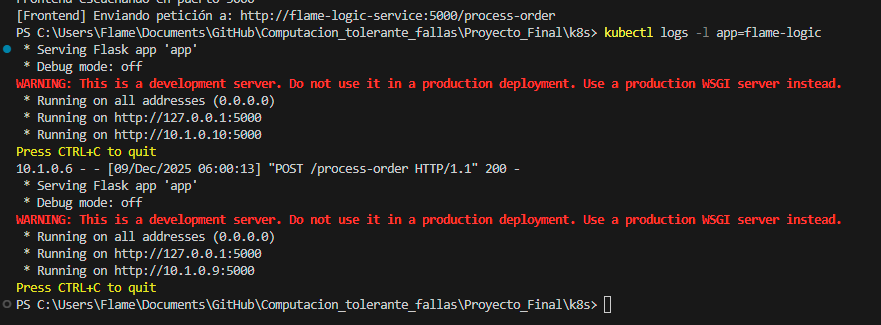


### 6. Automatización (CI/CD)
Se incluyen scripts de automatización (`deploy.ps1`) que estandarizan el proceso de:
1.  Construcción de imágenes (Build).
2.  Empaquetado.
3.  Despliegue al clúster (Deploy).

### 7. Diseño Escalable y Resiliente
* **Escalabilidad Horizontal:** El servicio de lógica está configurado con `replicas: 2` para balancear la carga.
* **Resiliencia:** El Frontend implementa manejo de errores (Try/Catch) para degradar el servicio elegantemente si el Backend falla, mostrando mensajes amigables al usuario en lugar de colapsar.

### 8. Seguridad y Aislamiento
* **Network Policy:** El servicio de lógica (`ClusterIP`) está aislado de internet; solo acepta peticiones del Frontend dentro de la red privada del clúster. Solo el Frontend expone puerto público (`LoadBalancer`).

### 9. Ingeniería del Caos (Chaos Engineering)
El sistema fue sometido a pruebas de estrés y fallos inyectados:
* **Nivel Infraestructura:** Eliminación manual de Pods en ejecución para verificar la regeneración automática por parte del ReplicaSet.
* **Nivel Aplicación:** Inyección de código en Python (`random fail`) que simula errores 500 aleatorios para probar la robustez del cliente.

---

## 🚀 Guía de Despliegue (Tutorial)

### Prerrequisitos
* Docker Desktop habilitado con Kubernetes.

  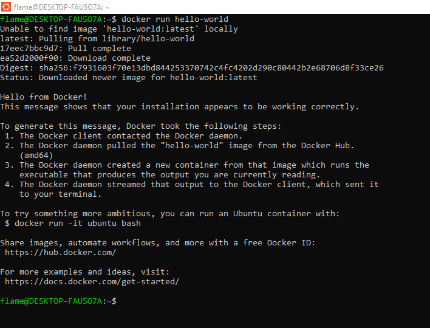

* Terminal (PowerShell o Bash).

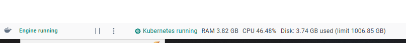

### Paso 1: Clonar y Ubicarse
```bash
git clone [https://github.com/DanielGaitan1/Computacion_tolerante_fallas/tree/main]
cd Computacion_tolerante_fallas/Proyecto_Final 
```
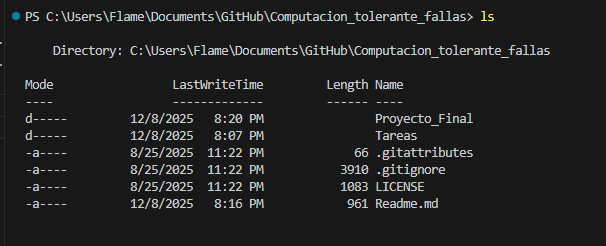
### Paso 2: Ejecutar Script de Automatización
Hemos creado un script que construye las imágenes y despliega los servicios automáticamente.

./deploy.ps1
(Alternativamente, despliegue manual):

```Bash
docker build -t flame-frontend:v1 ./service-frontend
docker build -t flame-logic:v1 ./service-logic
kubectl apply -f ./k8s/main-deployment.yaml
```

**Construyendo Frontend:**
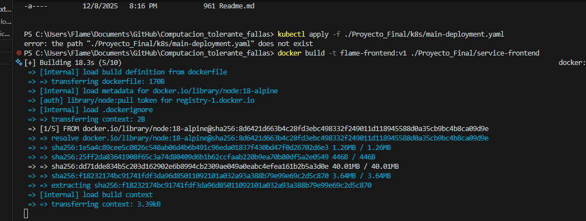

**Construyendo Logic Service:**
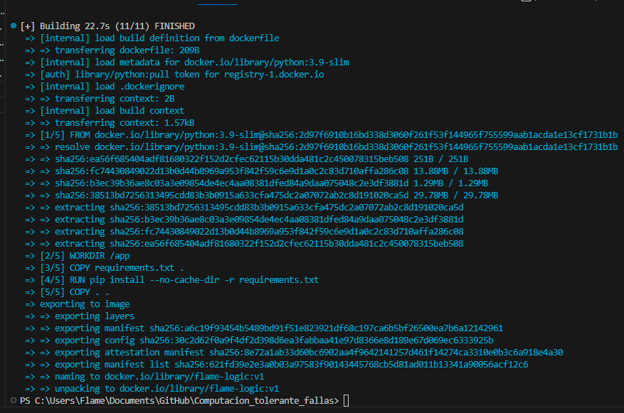


### Paso 3: Verificar y Probar
Verificar que los pods estén corriendo: kubectl get pods

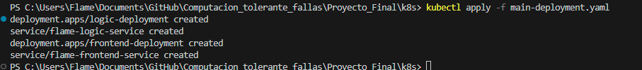


1. **Verificar que los pods estén corriendo:**
   `kubectl get pods`
   
   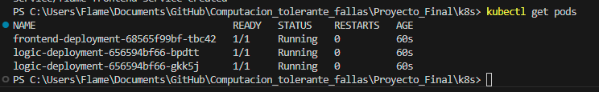

2. **Acceder a la web:**
   Entra a [http://localhost](http://localhost) en tu navegador. Deberás ver la interfaz del concierto.
   
   

3. **Simular una compra (Prueba de conexión):**
   Haz clic en "Comprar Boleto". Si todo funciona, verás el ID del ticket y qué contenedor lo procesó.
  
   

4. **Verificar logs en tiempo real:**
   `kubectl logs -l app=flame-logic`
   
   

Acceder a la web: http://localhost

---

## 🧪 Evidencias de Resiliencia (Chaos Testing)

El objetivo es demostrar que el sistema se recupera automáticamente tras un fallo crítico.

### Prueba 1: Eliminación Manual de un Pod (Pod Deletion)

**1. El Ataque:**
Eliminamos manualmente un pod del servicio de lógica para simular un "crash" o fallo fatal.
Comando: `kubectl delete pod logic-deployment-xxxxx`

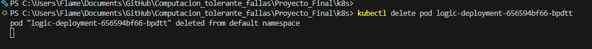

**2. La Recuperación (Self-Healing):**
Kubernetes detecta que falta una réplica y crea una nueva inmediatamente.
En la siguiente captura se observa:
* Pods antiguos (6 minutos de vida).
* **Nuevo Pod** (39 segundos de vida) creado automáticamente para reemplazar al eliminado.

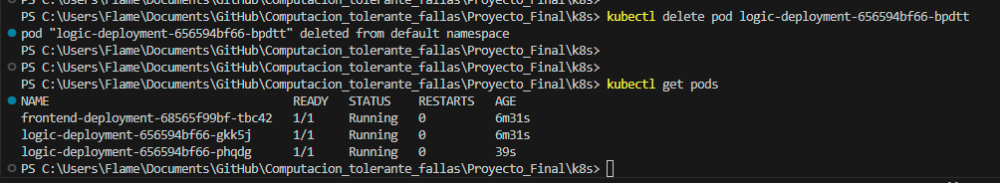


---

Write-Host "🌐 Accede en: http://localhost"


---

## 🧹 Limpieza del Entorno
Para detener y eliminar todos los servicios del clúster:
`kubectl delete -f ./k8s/main-deployment.yaml`

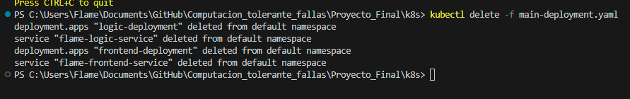

---
## 📊 Presentación Ejecutiva
Puedes consultar la presentación detallada del proyecto y la arquitectura aquí:
[📄 Ver Presentación del Proyecto (PDF)](./Presentacion_Proyecto.pdf)