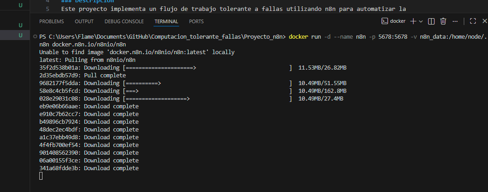
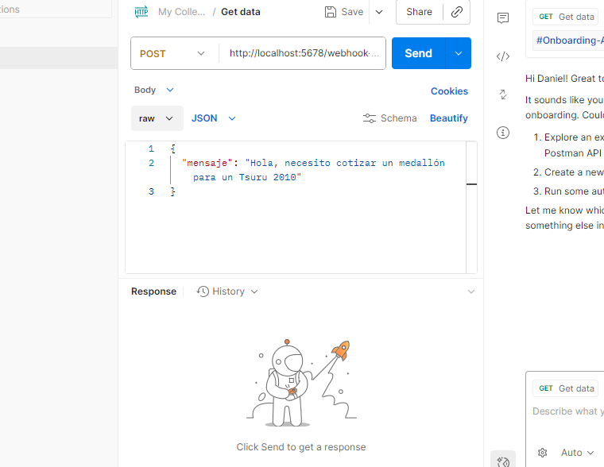
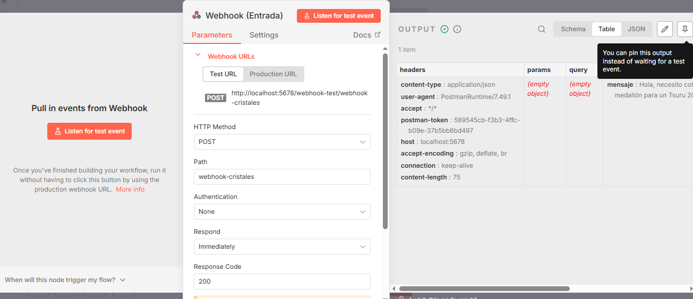
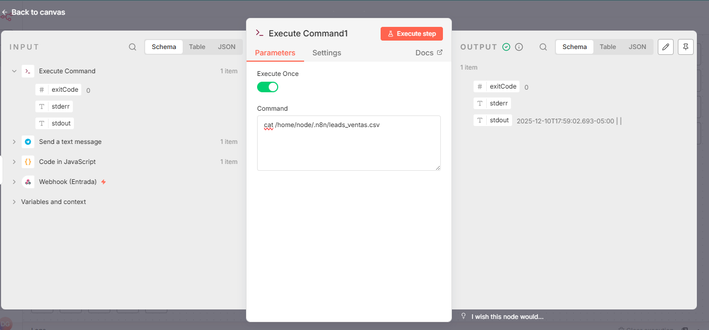

# 🛡️ Sistema de Clasificación de Leads Tolerante a Fallas (n8n + Docker)
### Proyecto de Automatización e Ingeniería de Software - Autocristales Gaitan

## 📋 Resumen Ejecutivo
Este proyecto implementa una arquitectura automatizada para la gestión de clientes potenciales (Leads). El sistema ingesta mensajes, procesa la intención del cliente y notifica al operador vía Telegram.

El enfoque principal del proyecto fue aplicar principios de **Computación Tolerante a Fallas**, diseñando un sistema que resiste la caída de servicios externos (APIs de IA) mediante mecanismos de simulación (Mocking) y degradación agraciada.

---

## 🎥 Demostración del Sistema

| Notificación en Tiempo Real (Móvil) | Ejecución del Flujo (Backend) |
| :---: | :---: |
|  |  |

---

## 🏗️ 1. Infraestructura y Despliegue (Docker)
Para garantizar la portabilidad y el aislamiento, el sistema se desplegó utilizando contenedores Docker. Se configuraron volúmenes persistentes para evitar pérdida de datos ante reinicios.

**Comando de instalación:**

**Estado del Contenedor:**
> Servicio n8n operando en puerto 5678 con consumo de recursos estable.

---

## 🧪 2. Ingesta de Datos
El flujo inicia con un **Webhook (POST)** que recibe datos estructurados desde herramientas de prueba (Postman) o formularios web.

**Trigger (Postman):**

**Recepción Exitosa:**

---

## ⚠️ 3. El Desafío: Fallo en la API de Inteligencia Artificial
Siguiendo la rúbrica de *"Investigar, Experimentar y Fallar"*, se intentó integrar la API de **Google Gemini (1.5 Flash)** para realizar procesamiento de lenguaje natural (NLP).

A pesar de configurar correctamente las credenciales y headers:

**Se documentó un fallo crítico de disponibilidad (Error 404):**
La API rechazó las conexiones debido a inconsistencias en el versionado de los modelos, representando un punto único de fallo para el sistema.

---

## 🛡️ 4. Solución: Arquitectura Tolerante a Fallas
Para evitar que el negocio se detuviera por el fallo de la IA, se implementó un patrón de **Mocking & Fallback**.

**Estrategia:**
Se reemplazó la dependencia externa por un módulo lógico interno (JavaScript Node) que:
1.  **Simula** la estructura de respuesta de la IA.
2.  **Garantiza** la integridad de los datos (`intencion`, `auto`).
3.  **Permite** que el flujo continúe hacia la notificación.

**Arquitectura Resiliente Resultante:**

---

## 🔬 5. Experimentación Extendida
Como parte de la investigación, se exploraron capacidades avanzadas de n8n, incluyendo la ejecución de comandos de sistema (`Execute Command`) para interactuar con el sistema de archivos local y generar logs en CSV.

**Flujo Extendido (Experimentación):**

**Interacción con Sistema de Archivos:**

---

## ✅ 6. Resultado Final
Gracias a la implementación de tolerancia a fallas, el sistema es capaz de entregar la alerta al operador humano sin interrupciones, independientemente del estado de la IA.

**Configuración del Bot:**

**Notificación Exitosa en Producción:**

---

## 🧠 Análisis Teórico: Model Context Protocol (MCP)
*Requisito de Investigación*

La problemática de conexión experimentada (Errores 404/Headers) resalta la necesidad de estándares como **MCP**.

**¿Cómo MCP resolvería esto?**
En lugar de configurar manualmente peticiones HTTP frágiles, un servidor MCP expondría recursos estandarizados (ej: `inventario_cristales`). El LLM interactuaría con estos recursos mediante un protocolo seguro y universal, eliminando la complejidad de las integraciones API directas y reduciendo la superficie de error humano.