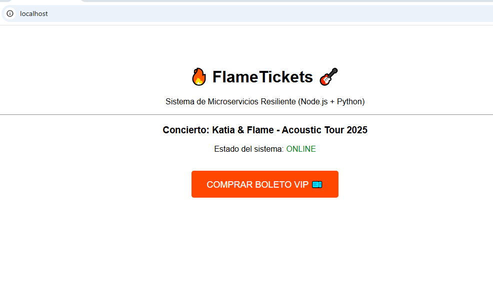
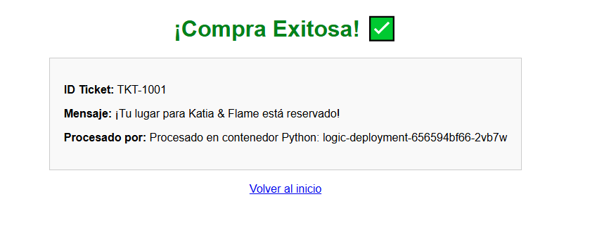
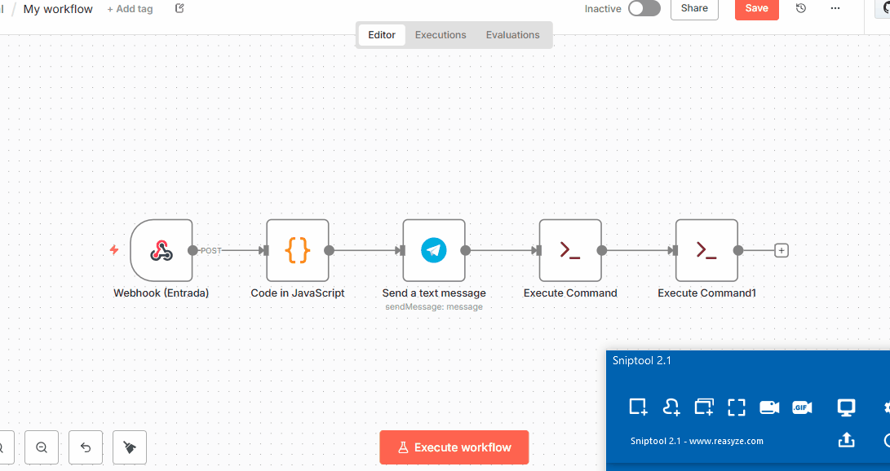

# Computación Tolerante a Fallas - Semestre 2025B

**Alumno:** Daniel Gaitan Chavez  
**Código:** 219294005  
**Ciclo:** 2025B  
**Repositorio de Evidencias**

---

## 📂 Descripción General
Este repositorio centraliza las evidencias de aprendizaje, prácticas de laboratorio y proyectos de ingeniería desarrollados durante el curso. El enfoque principal es la implementación de sistemas robustos, resilientes y capaces de operar bajo condiciones de error.

---

##  Proyectos Principales

###  1. Proyecto Final: FlameTickets (Microservices)
> **Ubicación:** [`/Proyecto_Final`](./Proyecto_Final) 

Implementación de una arquitectura de microservicios resiliente para venta de boletos.
* **Tech Stack:** Docker, Kubernetes, Node.js, Python.
* **Enfoque de Tolerancia a Fallas:** Simulación de caos (Chaos Engineering), replicación de pods y recuperación automática.

###  2. Proyecto: Sistema de Automatización Resiliente con n8n
> **Ubicación:** [`/Proyecto_n8n`](./Proyecto_n8n)

**📸 Vista Previa del Resultado Final:**

| Backend (Ejecución del Flujo) | Frontend (Alerta al Usuario) |
| :---: | :---: |
|  |  |

*Nota: Entrar a la carpeta del proyecto para ver la documentación técnica completa y el análisis de fallos.*

Desarrollo de un flujo de trabajo automatizado para la clasificación de leads (Autocristales Gaitan).
* **Tech Stack:** n8n (Self-hosted en Docker), JavaScript, Telegram API.
* **Enfoque de Tolerancia a Fallas:** Implementación de patrones de **Mocking y Fallback**. El sistema fue diseñado para sobrevivir a la caída de servicios externos (APIs de IA) mediante módulos de lógica de respaldo, garantizando la continuidad del negocio.

---

## 📚 Bitácora de Actividades y Tareas

A continuación, se listan las prácticas menores y asignaciones teóricas:

* **01. Herramientas de Manejo de Errores:** Investigación sobre excepciones y logs.
* **02. Introducción a Docker:** Prácticas iniciales de contenedorización.
* **03. Fundamentos de Automatización:** (Evolucionó al Proyecto n8n listado arriba).

---